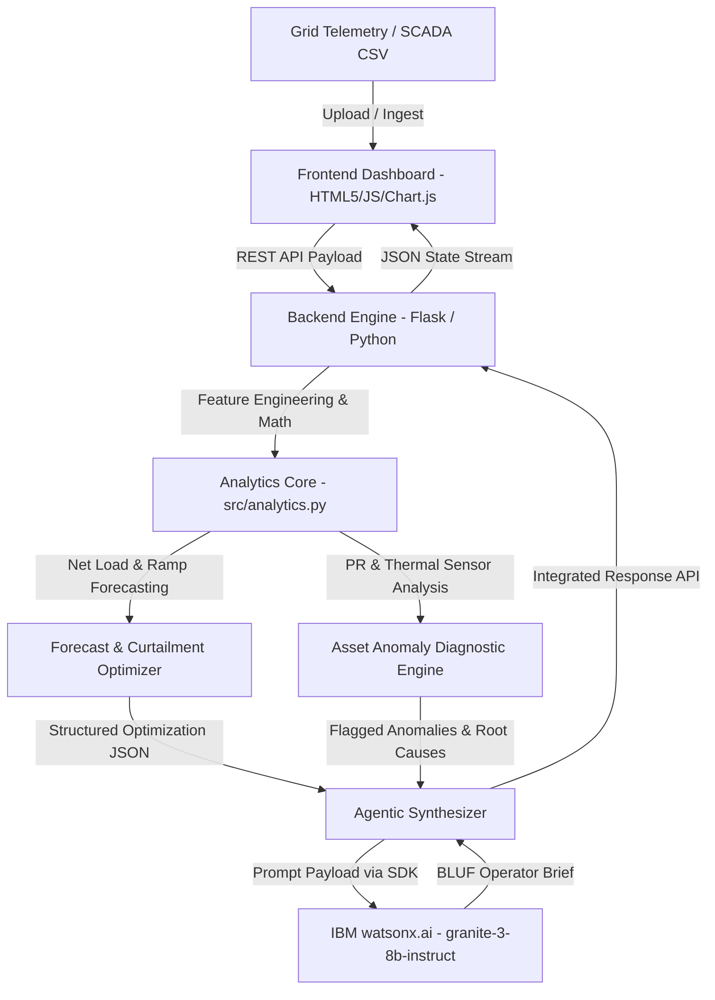

# Architecture — GridVision AI

## System Architecture

The GridVision AI platform is designed as an agentic, event-driven decision support system. It continuously ingests time-series electrical grid telemetry and asset SCADA sensor feeds, executes dual-horizon load and renewable forecasting, computes physics-informed asset degradation metrics, runs curtailment-minimisation storage dispatch math, and synthesises shift-ready operational briefings through IBM watsonx foundation models.

## Components

| Component | Technology | Responsibility |
|---|---|---|
| Frontend Dashboard | HTML5, Modern CSS, Vanilla JS, Chart.js | Visualizes 24-hour demand vs. renewables curves, displays interactive asset status cards, and provides CSV upload interfaces. |
| Backend API Service | Python 3.10+, Flask RESTful API | Coordinates endpoint routing (`/api/analyze`, `/api/sample`), orchestrates data validation, and maps incoming column aliases. |
| Analytics Core | Pandas, NumPy, SciPy | Computes net-load equations, flags ramp-rate breaches (> 50 MW/hr), and models battery storage (BESS) state-of-charge constraints. |
| Asset Diagnostic Module | Python (physics-informed rules) | Calculates solar/wind Performance Ratios (PR) and identifies root causes such as inverter thermal clipping, soiling, and blade pitch degradation. |
| Agentic Brief Generator | IBM watsonx.ai Python SDK (`ibm-watsonx-ai`) | Queries `ibm/granite-3-8b-instruct` to turn numerical telemetry into an executive Bottom-Line-Up-Front (BLUF) operational memo. |
| Development & Pair Agent | IBM Bob IDE (Required) | Supports code generation, architectural scaffolding, refactoring, and session export tracking under `bob_sessions/`. |

## Data Flow

1. Telemetry Ingestion & Column Normalization: The user uploads a 24-hour sensor log CSV (or selects the built-in sample day) via the web interface. The backend ingests the file and automatically normalizes varied naming schemas into standardized internal parameters (grid_demand_mw, actual_solar_mw, actual_wind_mw, inverter_temp_c).
2. ### 📈 Net Load & Ramp Analytics
   `src/analytics.py` calculates hourly net load:
   $$\text{Net Load}(t) = \text{Demand}(t) - \left(P_{\text{solar}}(t) + P_{\text{wind}}(t)\right)$$
   It calculates the hourly ramp rate $\frac{\Delta\text{Net Load}}{\Delta t}$ and flags critical evening ramp windows exceeding $50\text{ MW/hr}$.
3. Asset Diagnostics & Root Cause Tagging: The engine evaluates asset-level telemetry against theoretical output expectations. Units exhibiting a Performance Ratio below threshold under high irradiance with elevated inverter temperatures are tagged with root-cause labels (e.g., Thermal Derating / Heat Exchanger Clogging).
4. Curtailment & BESS Scheduling: Where renewable generation exceeds grid load, the optimization algorithm allocates charge cycles to a 50 MWh Battery Energy Storage System (BESS) up to its 90% State-of-Charge limit, quantifying avoided curtailment (MWh) and planning evening peak discharge.
5. Agentic Synthesis via IBM Granite: The aggregated numerical results (peak ramp hours, avoided curtailment, asset warnings) are structured into a JSON payload and forwarded to watsonx.ai. The granite-3-8b-instruct model outputs a structured, actionable BLUF operator dispatch brief.
6. Client-Side Rendering: The Flask backend returns the complete calculation payload to the browser, which updates the Chart.js visualizer, colors the asset alert status indicators, and displays the AI brief.

## Security Considerations

- Environment Variable Credential Isolation: All IBM Cloud API keys, project IDs, and service credentials are kept exclusively in local .env files and managed through os.getenv().  
- Strict Repository Guardrails: The .gitignore and .bobignore files are explicitly pre-configured to block .env, credentials, local secrets, and raw keys from ever being staged or committed to the public GitHub repository, in full compliance with IBM Security policies.  
- Zero Client Confidential Data: The system operates exclusively on synthetic or open-access public transmission and plant telemetry, ensuring zero exposure of proprietary utility credentials or personally identifiable information (PI). 

## Scalability Notes

- Stateless API Core: The Flask backend service is entirely stateless; requests can be horizontally scaled behind a cloud load balancer across multiple production instances. 
- Edge Diagnostics Integration: The deterministic asset-level Performance Ratio checks are computationally lightweight ($O(N)$ complexity) and can be deployed as edge microservices directly inside substation RTUs or plant SCADA concentrators.
-  Watsonx Token Efficiency: Rather than streaming raw multi-row time-series arrays directly to the LLM, the analytics engine pre-aggregates the data into a dense summary JSON, reducing token consumption and minimizing foundation model inferencing latency to under 2 seconds.

## Key Design Decisions

| Decision | Rationale |
|---|---|
| Physics-Informed Deterministic Diagnostics | Sensor failure modes like inverter thermal clipping and panel soiling follow known physical equations; rule-based Performance Ratio thresholds are faster, transparent, and more reliable than black-box models. |
| Pre-Aggregation Before LLM Inference | Passing structured summary JSON rather than thousands of raw time-series rows to IBM Granite conserves watsonx Resource Units (RUs), prevents hallucination, and reduces inference latency. |
| Dynamic Column Normalization | Permissive column matching ensures telemetry CSVs from varying SCADA or AMI sources run smoothly without formatting failures. |
| IBM Bob IDE for Full-Stack Scaffolding | Bob's Plan and Code modes scaffolded the backend API, algorithms, and automated test suite while tracking development sessions under `bob_sessions/`. |
