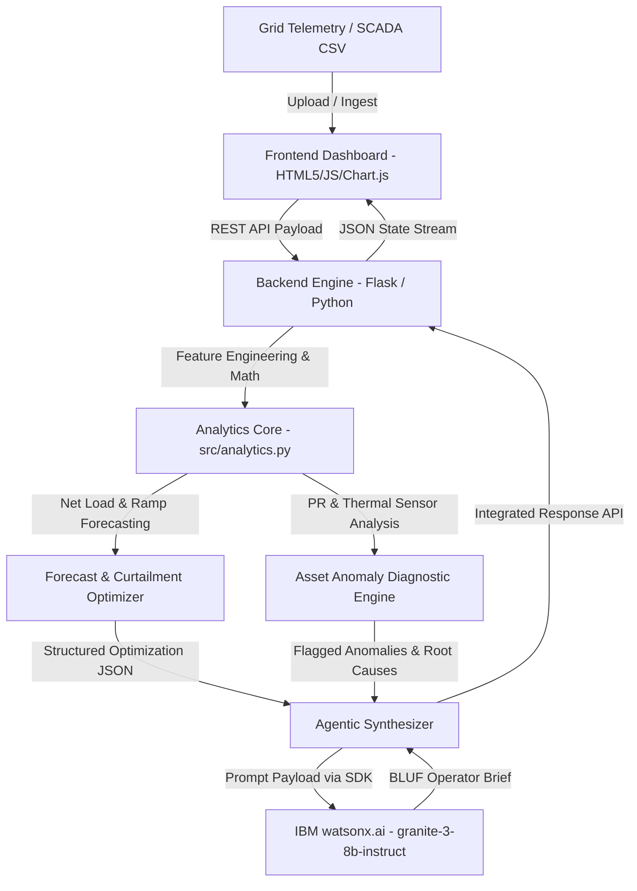

 Architecture

## System Architecture

The GridPulse AI platform is designed as an agentic, event-driven decision support system. It continuously ingests time-series electrical grid telemetry and asset SCADA sensor feeds, executes dual-horizon load and renewable forecasting, computes physics-informed asset degradation metrics, runs curtailment-minimization storage dispatch math, and synthesizes shift-ready operational briefings through IBM watsonx foundation models.

## Components

| Component | Technology | Responsibility |
|---|---|---|
| Frontend | [e.g., React 18] | [e.g., Dashboard UI, user interaction] |
| Backend API | [e.g., FastAPI] | [e.g., Business logic, orchestration] |
| AI / ML | [e.g., watsonx.ai] | [e.g., Anomaly scoring, classification] |
| Database | [e.g., PostgreSQL] | [e.g., Storing pipeline events and scores] |
| Notifications | [e.g., Slack API] | [e.g., Alerting on threshold breaches] |

## Data Flow

[Describe how data moves through your system from input to output.]

1. Telemetry Ingestion & Column Normalization: The user uploads a 24-hour sensor log CSV (or selects the built-in sample day) via the web interface. The backend ingests the file and automatically normalizes varied naming schemas into standardized internal parameters (grid_demand_mw, actual_solar_mw, actual_wind_mw, inverter_temp_c).
2. ### 📈 Net Load & Ramp Analytics 
* **Net Load Formula:**  
  `Net Load(t) = Demand(t) - [P_solar(t) + P_wind(t)]`
* **Ramp Rate Formula:**  
  `Ramp Rate = Δ(Net Load) / Δt`
* **Critical Flag:** Triggers on evening ramp windows exceeding **50 MW/hr**.

3. Asset Diagnostics & Root Cause Tagging: The engine evaluates asset-level telemetry against theoretical output expectations. Units exhibiting a Performance Ratio below threshold under high irradiance with elevated inverter temperatures are tagged with root-cause labels (e.g., Thermal Derating / Heat Exchanger Clogging).
4. Curtailment & BESS Scheduling: Where renewable generation exceeds grid load, the optimization algorithm allocates charge cycles to a 50 MWh Battery Energy Storage System (BESS) up to its 90% State-of-Charge limit, quantifying avoided curtailment (MWh) and planning evening peak discharge.
5. Agentic Synthesis via IBM Granite: The aggregated numerical results (peak ramp hours, avoided curtailment, asset warnings) are structured into a JSON payload and forwarded to watsonx.ai. The granite-3-8b-instruct model outputs a structured, actionable BLUF operator dispatch brief.
6. Client-Side Rendering: The Flask backend returns the complete calculation payload to the browser, which updates the Chart.js visualizer, colors the asset alert status indicators, and displays the AI brief.

## Security Considerations

- Environment Variable Credential Isolation: All IBM Cloud API keys, project IDs, and service credentials are kept exclusively in local .env files and managed through os.getenv().  
- Strict Repository Guardrails: The .gitignore and .bobignore files are explicitly pre-configured to block .env, credentials, local secrets, and raw keys from ever being staged or committed to the public GitHub repository, in full compliance with IBM Security policies.  
- Zero Client Confidential Data: The system operates exclusively on synthetic or open-access public transmission and plant telemetry, ensuring zero exposure of proprietary utility credentials or personally identifiable information (PI). 

## Scalability Notes

- Stateless API Core: The Flask backend service is entirely stateless; requests can be horizontally scaled behind a cloud load balancer across multiple production instances. 
- Edge Diagnostics Integration: The deterministic asset-level Performance Ratio checks are computationally lightweight (`O(N)` complexity) and can be deployed as edge microservices directly inside substation RTUs or plant SCADA concentrators.  
-  Watsonx Token Efficiency: Rather than streaming raw multi-row time-series arrays directly to the LLM, the analytics engine pre-aggregates the data into a dense summary JSON, reducing token consumption and minimizing foundation model inferencing latency to under 2 seconds. 